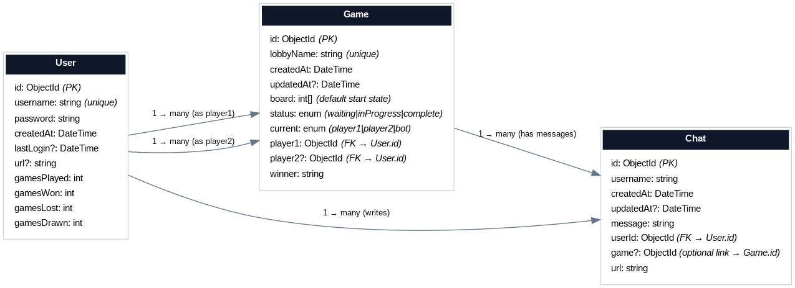

# 🕹️ Mancala Multiplayer Game

This is a real-time multiplayer **Mancala** game built with [Next.js](https://nextjs.org), [Socket.IO](https://socket.io/), [Prisma](https://www.prisma.io/), and [MongoDB Atlas](https://www.mongodb.com/atlas). The app supports interactive gameplay, persistent user sessions, and live game state updates.

> **Note**: The WebSocket server is hosted separately. You can find its repository here: [mancalaSocket](https://github.com/csz8115/mancalaSocket)

## 🚀 Getting Started

You can try the live production version [here](https://mancala-three.vercel.app/login)

## Overview

This is a fullstack application with an emphasis on real time systems and scalable system architecture.
The application has a split deployment on Vercel and Render.
- Frontend & API Layer (Next.js on Vercel): Handles authentication, and session management.
- WebSocket Server (Render): Powers live gameplay and chat features using Socket.IO, overcoming edge-function limitations of Vercel hosting.
- Data Layer (MongoDB Atlas + Prisma ORM): Provides a high availability, cloud database for user accounts, game history, and real-time statistics, with Prisma and Zod ensuring type-safe queries and schema management.

## Tech Stack 

### Frameworks & Core Libaries
- NextJS (React, Typescript, Hooks)
- Socket.io (Real-Time Communication)
- Prisma ORM (MongoDB Schema & Queries)
- TailwindCSS & ShadCN (UI)

### Databases
- MongoDB Atlas (cloud database)

### Deployment
- Vercel (NextJS app deployment)
- Render (Socket.io app deployment)

## Database Structure

This system uses Prisma ORM to build a schema defining schemas and relationships.

### Models

- User → Authentication details, stats, and session info.
- Game → Stores game states, results, and timestamps.
- Chat → Stores real-time chat messages.



### ⚡ Game Completion Trigger
When a game is marked as **`complete`**, an application-level trigger (via Prisma `$extends`) automatically updates player stats:

- Increments `gamesPlayed` for both users  
- Adjusts `gamesWon`, `gamesLost`, or `gamesDrawn` depending on the outcome  
- Logs updates for observability  

Example snippet:  
```ts
// Triggered when Game.status = complete
if (result.status === Status.complete) {
  await prisma.user.update({
    where: { id: player1 },
    data: { gamesPlayed: { increment: 1 }, gamesWon: { increment: 1 } }
  });
  // ...updates player2 accordingly
}
```

## 🔌 Real-Time Socket Events

This application uses **Socket.IO** to synchronize gameplay and chat between players in real time.  
Each event is validated on the server, persisted to the database, and broadcasted to all connected clients.

### Core Events

- **connection / disconnect** → Tracks active users and cleans up sessions.  
- **createLobby** → Creates a new game lobby and waits for an opponent.  
- **joinLobby** → Allows a player to join an existing lobby.  
- **makeMove** → Validates player moves, updates board state, persists to MongoDB, and broadcasts the new state.  
- **gameOver** → Records the winner, updates user stats, and closes the session.  
- **sendMessage** → Handles real-time chat between players within the lobby.  
- **updateStats** → Triggers after game completion to update `gamesPlayed`, `gamesWon`, `gamesLost`, etc.  

## Frontend Showcase

- Login/Register Page

- Dashboard

- Game Lobby 

- Game Board

- Player Profile

- Player Stats

## Testing

This project includes a comprehensive testing suite including Unit, Integration, and API level testing
- Unit Tests: Validate game logic, board state transitions, and helper functions.
- Integration Tests: Simulate player actions across WebSocket events and ensure consistent game outcomes.
- API Tests: Validate authentication, game creation, and stat updates using Jest + Supertest.

### Running Tests

```bash
# Run all Jest tests
npm run test

# Run with coverage report
npm run test:coverage

# Run integration tests only
npm run test:integration

```

Test files live in the test directory 
```text
__tests__/
  ├── unit/
  │   ├── db.tests.ts
  │   ├── game-logic.tests.ts
  │   ├── session.tests.ts
  │   ├── user-actions.tests.ts
  │   └── utils.tests.ts
```
  
## Future Improvements

- Single Player mode with minimax algorithm
- Friends list and matchmaking.
- Analytics dashboard for win/loss trends.
- Dockerized deployment for containerized scaling.

